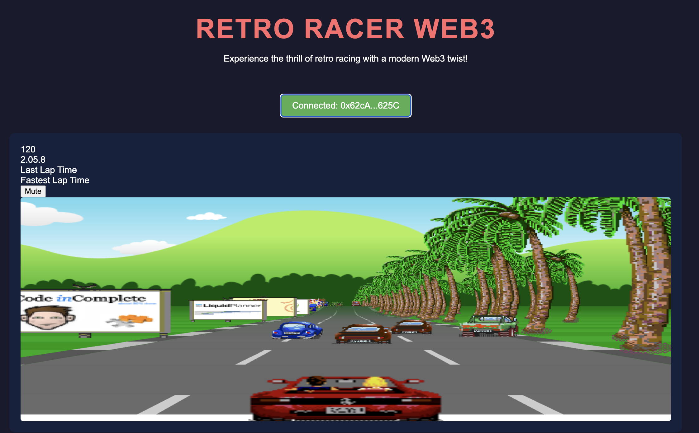

# Web3 Racer

Web3 Racer is an exciting blockchain-integrated racing game that combines the thrill of retro-style racing with modern Web3 technology. This project is a fork of [Jake Gordon's JavaScript Racer](https://github.com/jakesgordon/javascript-racer), enhanced with blockchain features for a unique gaming experience.

## Features

- Retro-style racing gameplay
- Web3 integration for blockchain interaction
- Leaderboard system stored on the blockchain
- Wallet connection for player identification

## Smart Contract

The game interacts with a smart contract deployed on the Sepolia testnet:

- Contract Address: `0x675332F3519EE5C540F7544953963937db8B4459`
- [View on Etherscan](https://sepolia.etherscan.io/address/0x675332f3519ee5c540f7544953963937db8b4459)

## Getting Started

### Prerequisites

- A modern web browser
- MetaMask or another Web3-compatible wallet extension
## How to Play

1. Connect your Web3 wallet (e.g., MetaMask) to the Sepolia testnet.
2. Click the "Connect Web3 Wallet" button on the game page.
3. Once connected, the game will start.
4. Use arrow keys or WASD to control your car.
5. Complete laps and try to achieve the best time!
6. Your high scores will be submitted to the blockchain leaderboard.

## Development

To modify or extend the game:

1. Edit the JavaScript files in the `game` directory.
2. Modify `web3Integration.js` for blockchain interaction logic.
3. Update `index.html` and `styles.css` for layout and styling changes.

## Contributing

Contributions are welcome! Please feel free to submit a Pull Request.

## License

This project is licensed under the MIT License - see the [LICENSE](LICENSE) file for details.

## Acknowledgments

- Original game by [Jake Gordon](https://github.com/jakesgordon)
- Web3 integration and modifications by [Your Name/Team]

## Contact

For any queries or suggestions, please open an issue on this repository.

Enjoy racing in the Web3 world!
